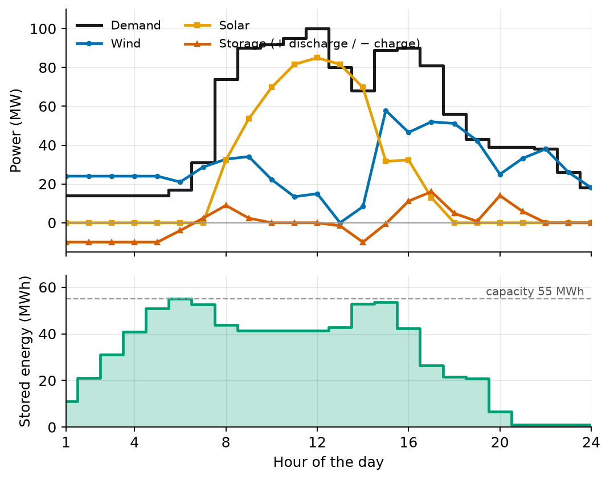
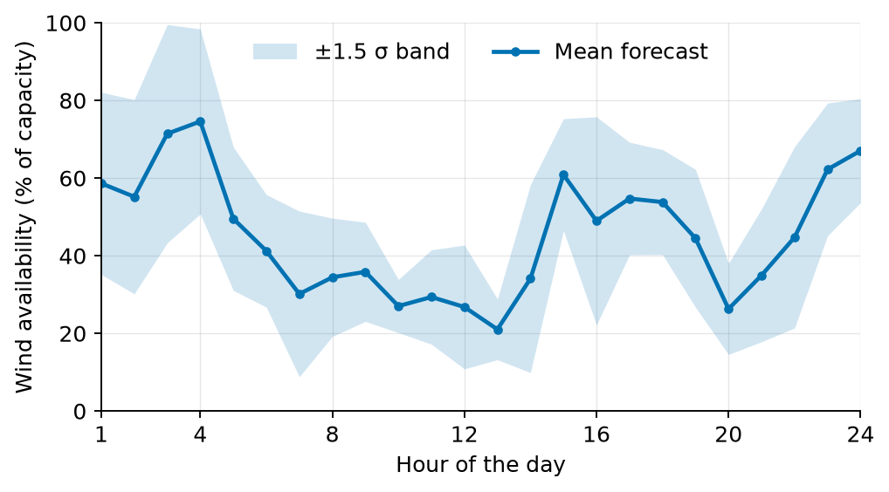

# Power System Integration of Renewable Energy

**Cost-optimal dispatch of wind, solar, and battery storage under renewable
uncertainty — a linear-programming model in Julia/JuMP with probabilistic wind
forecasting.**

[](https://julialang.org)
[](https://jump.dev)
[](LICENSE)

The model schedules the hourly output of a 95 MW wind plant, an 85 MW solar
plant, and a 55 MWh battery over a 24-hour horizon so that a variable grid
demand is met at minimum production cost. Wind availability is forecast
probabilistically by Monte-Carlo bootstrap resampling of 30 days of historical
generation data (U.S. EIA); solar availability follows the measured hourly
solar-radiation profile for New York City in September (south-facing panel,
40° tilt). Battery cycling is discouraged by a degradation penalty on
discharged energy.

**Key results** (New York City case study):

- Optimal 24-hour production cost: **≈ \$34,990**
- Minimum storage capacity for feasibility: **52.9 MWh ≈ 53 MWh** (found by
  bisection on the capacity — see the [sensitivity script](scripts/storage_capacity_sweep.jl))
- Above that threshold, extra capacity buys only marginal savings: the battery
  is sized by the evening supply deficit, not by economics.



## Model formulation

Decision variables per hour $h$: wind output $P^W_h$, solar output $P^S_h$,
storage discharge $P^{dis}_h \ge 0$, and storage charge $P^{ch}_h \ge 0$.

$$
\min \; \sum_{h=1}^{24} \left( C^W_h P^W_h + C^S_h P^S_h + c_{\mathrm{deg}} P^{dis}_h \right)
$$

subject to, for every hour $h$:

$$
\begin{aligned}
P^W_h + P^S_h + P^{dis}_h - P^{ch}_h &= P^D_h
&& \text{(power balance)} \\
0 \le P^W_h \le A^W_h P^W_{max}, \quad
0 \le P^S_h &\le A^S_h P^S_{max}
&& \text{(availability limits)} \\
0 \le P^{dis}_h \le P^{dis}_{max}, \quad
0 \le P^{ch}_h &\le P^{ch}_{max}
&& \text{(converter limits)} \\
Q^B_{min} \le Q^B_0 + \sum_{j \le h} \left( P^{ch}_j - P^{dis}_j \right) &\le Q^B_{max}
&& \text{(state of charge)}
\end{aligned}
$$

Generation is priced higher when the resource is scarce,

$$
C_h = C_0 \, \frac{2}{1 + A_h},
$$

so the availability factors $A^W_h, A^S_h \in [0,1]$ shape both the feasible
set and the cost coefficients. The battery degradation penalty
$c_{\mathrm{deg}}$ prices cycling wear on discharged energy. The result is a
pure linear program.

## Wind uncertainty

The day-ahead wind availability $A^W_h$ is the mean of 1,000 Monte-Carlo
bootstrap samples over 30 days of historical hourly generation; resampling
whole days preserves the intra-day correlation structure.



## Repository structure

```
├── data/
│   ├── demand_24h.csv               # hourly grid demand (MW)
│   ├── solar_availability_24h.csv   # hourly solar availability (%)
│   └── wind_history_30d.csv         # 30 days × 24 h historical wind generation (EIA)
├── src/
│   ├── data_loading.jl              # CSV loaders
│   ├── wind_forecast.jl             # Monte-Carlo bootstrap wind forecast
│   └── dispatch_model.jl            # JuMP model builder and solver
├── scripts/
│   ├── run_dispatch.jl              # main result: optimal dispatch + figures
│   └── storage_capacity_sweep.jl    # minimum-capacity bisection + cost curve
├── figures/                         # generated figures
└── report/                          # LaTeX source and PDF of the technical report
```

## Getting started

```bash
julia --project -e 'using Pkg; Pkg.instantiate()'
julia --project scripts/run_dispatch.jl
julia --project scripts/storage_capacity_sweep.jl
```

The scripts print the hourly dispatch schedule and the optimal cost, and write
the figures shown above into `figures/`. The Monte-Carlo forecast uses a fixed
RNG seed, so results are reproducible; without a seed the optimal cost varies
by a few tens of dollars across runs.

### Solver

The LP is solved with the open-source [HiGHS](https://highs.dev) solver by
default. Any LP-capable solver with a JuMP wrapper works — e.g. with
[Gurobi](https://github.com/jump-dev/Gurobi.jl) installed:

```julia
using Gurobi
result = solve_dispatch(demand, wind_availability, solar_availability;
                        optimizer = Gurobi.Optimizer)
```

## Report

A full write-up — formulation, availability modeling, case-study results, and
the storage-capacity sensitivity analysis — is in
[`report/report.pdf`](report/report.pdf) (LaTeX source alongside; build with
`pdflatex report.tex`).

## Citation

If you use this model or data pipeline, please cite it (see
[`CITATION.cff`](CITATION.cff)):

> R. Emami Mirak, *Power System Integration of Renewable Energy*, 2023.
> https://github.com/ra-emami/power-system-integration-of-renewable-energy

## Author

**Rahmat Emami Mirak** — r.emamimirak@gmail.com · ra.emami@aut.ac.ir

Released under the [MIT License](LICENSE).
